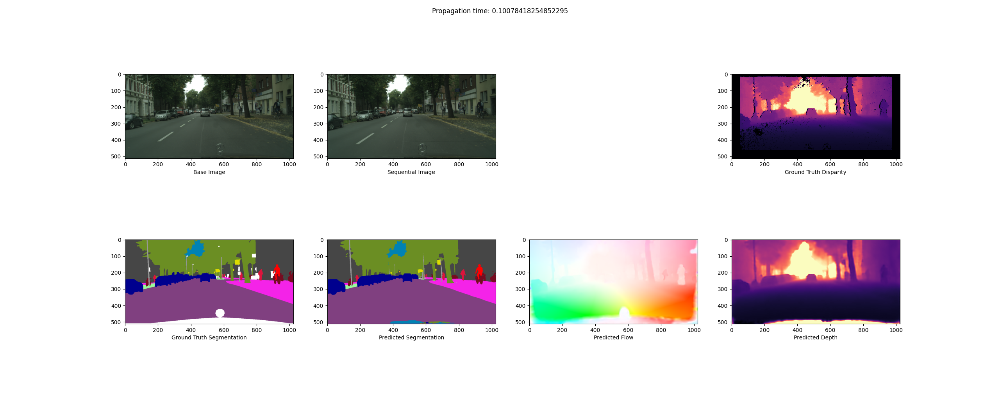
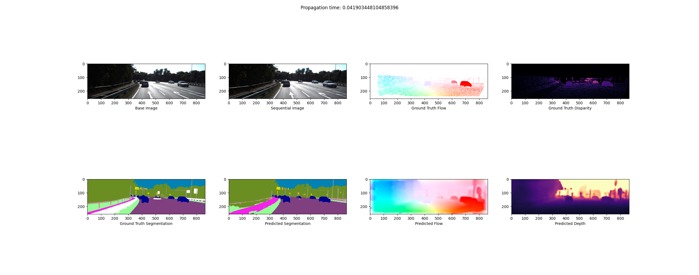

# <s>Stereo</s> <s>Mono</s> <s>-to-All</s> Cerberus-Net

The aim of this project is to generate a pointcloud with motion vectors and semantic segmentation of <s>stereoscopic</s> monoscopic image sequences. Targeting real-time deployment on an nVIDIA Xavier.

This is Public Repository for my Final Year Project since all my other projects/work is under the private Monash Motorsport git, so others don't have to take my word for it that I'm somewhat experienced and have some actual code to show publicly.

Model performs well in all categories against current state-of-the-art implementations which only focus on one task. Current TensorRT inference runtime is ~80ms with FP32 and ~30ms with FP16 on an RTX 3090 at 1024x512 (batchsize 1) without optimising the redundant passes through HRNetV2 encoder.

## Cityscapes Segmentation + Flow + Depth

## KITTI Segmentaiton + Flow

## Dependencies
### On the C++ Side of Things:
Runtime inference has been performed with the following libraries:

 - CUDA 11.1
 - TensorRT 7.2.1.6
 - cuDNN 8.0.4.30
 - OpenCV 4.1.1
 - CMake 3.8

### On the Python Side of Things:
Training is achieved with usual suspects for the most part (I think that's):
 - Pytorch 1.7
 - Onnx 1.6.0
 - Numpy 1.19.4
 - Matplotlib 3.3.2
 - cv2 4.4.0
 - easydict
 - h5py 2.10.0
 - seaborn 0.11.0
 - pandas 1.1.3
 - scipy 1.5.3
